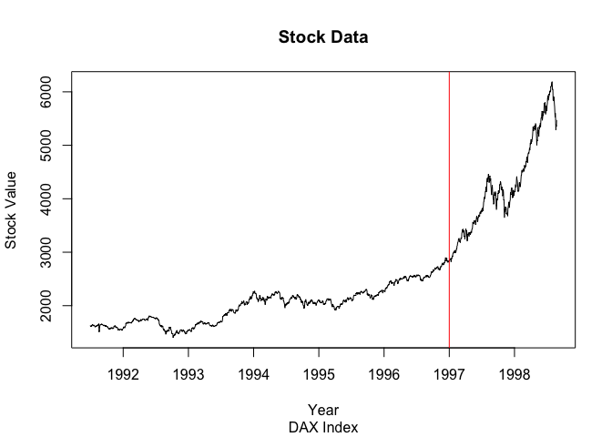
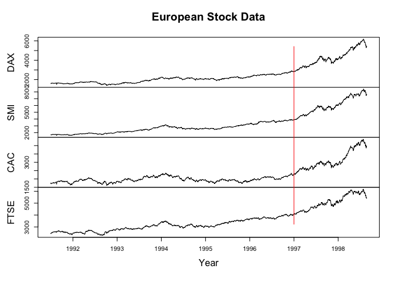
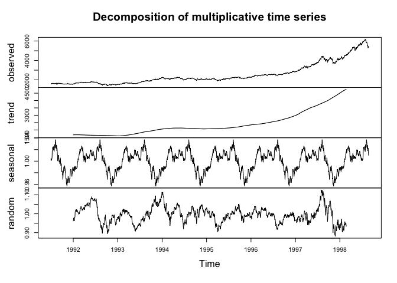
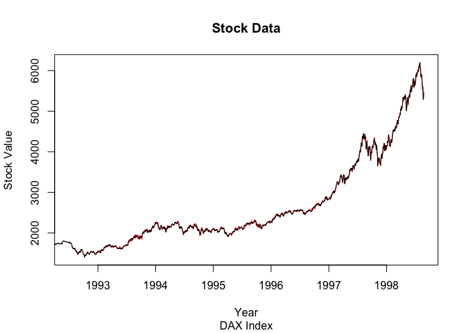
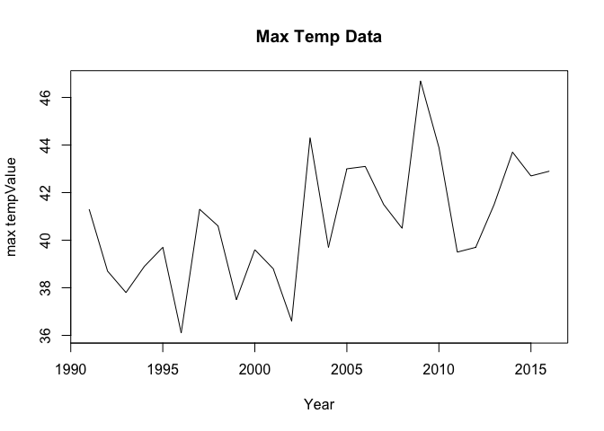
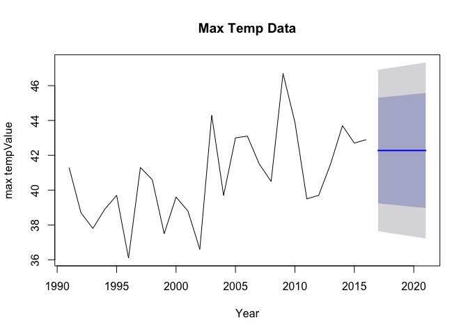
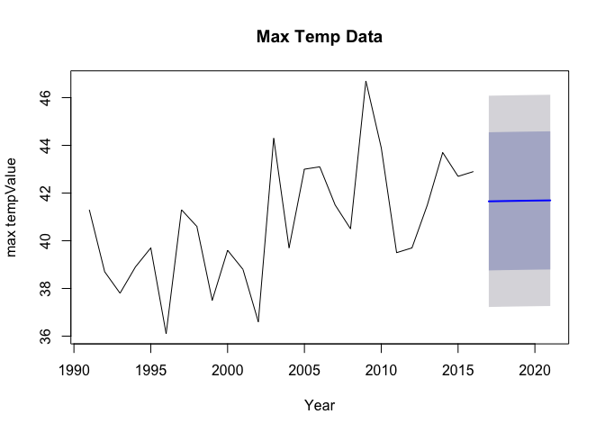

# TimeSeries Assignment11
Venkat Kasarla  
11/30/2017  


## Presented by  Venkat Kasarla 

<br>

# Introduction
Present the answrs to the TimeSeries data questions for time series data sets.

<br>

###  1.a Pull the DAX  index


```r
help(EuStockMarkets) 
dax <- EuStockMarkets[,"DAX"]
```

<br>

### 1.b plot data and   add a vertical red line to your plot which divides pre-1997 and post-1997 


```r
plot(dax,main="Stock Data", sub="DAX Index",xlab="Year", ylab="Stock Value")
abline(v=1997, col="red")
```

<!-- -->

```r
plot(EuStockMarkets,main="European Stock Data",xlab="Year", ylab="Stock Value")
abline(v=1997, col="red")
```

<!-- -->


<br>

### 1.c Decompose the time series into its components


```r
dax.comp <- decompose(dax, type="mult")
plot(dax.comp)
```

<!-- -->

```r
#HoltWinters filtering on indices
dax.hw <- HoltWinters(dax)

plot(dax.hw,main="Stock Data", sub="DAX Index",xlab="Year", ylab="Stock Value")
```

<!-- -->


<br>

### 2.a  load fpp2 and look at ffp2 temperature dataset


```r
help(maxtemp)
??maxtemp
```

### 2.b Subset after 1990 year


```r
temp.data<-window(maxtemp, start=1991,initial=c("optimal"))
```

<br>

### c SES to predict the next five years of maximum temperatures in Melbourne. plot this infromation


```r
plot(temp.data,main="Max Temp Data",xlab="Year", ylab="max tempValue")
```

<!-- -->

```r
fcast.ses <- ses(temp.data,h=5)
plot(fcast.ses,main="Max Temp Data",xlab="Year", ylab="max tempValue")
```

<!-- -->

<br>

### 2.d damped Holt’s linear trend to also predict out five years


```r
fcast.holt <- holt(temp.data,h=5,initial=c("optimal"),damped=TRUE)
plot(fcast.holt,main="Max Temp Data",xlab="Year", ylab="max tempValue")
```

<!-- -->


<br>


### 2.e Compare the AICc - Best value in models is to choose the one with the minimum AIC value.SES perefed as it has Low AICc value


```r
summary(fcast.ses)
```

```
## 
## Forecast method: Simple exponential smoothing
## 
## Model Information:
## Simple exponential smoothing 
## 
## Call:
##  ses(y = temp.data, h = 5) 
## 
##   Smoothing parameters:
##     alpha = 0.2156 
## 
##   Initial states:
##     l = 39.4411 
## 
##   sigma:  2.365
## 
##      AIC     AICc      BIC 
## 135.4711 136.5621 139.2454 
## 
## Error measures:
##                     ME     RMSE      MAE       MPE     MAPE      MASE
## Training set 0.5055235 2.365008 1.834766 0.9444266 4.443746 0.7619461
##                     ACF1
## Training set -0.07711223
## 
## Forecasts:
##      Point Forecast    Lo 80    Hi 80    Lo 95    Hi 95
## 2017       42.27523 39.24435 45.30611 37.63990 46.91056
## 2018       42.27523 39.17469 45.37577 37.53337 47.01710
## 2019       42.27523 39.10656 45.44390 37.42917 47.12129
## 2020       42.27523 39.03987 45.51060 37.32717 47.22330
## 2021       42.27523 38.97452 45.57594 37.22723 47.32324
```

```r
summary(fcast.holt)
```

```
## 
## Forecast method: Damped Holt's method
## 
## Model Information:
## Damped Holt's method 
## 
## Call:
##  holt(y = temp.data, h = 5, damped = TRUE, initial = c("optimal")) 
## 
##   Smoothing parameters:
##     alpha = 1e-04 
##     beta  = 1e-04 
##     phi   = 0.8795 
## 
##   Initial states:
##     l = 38.6438 
##     b = 0.4263 
## 
##   sigma:  2.2595
## 
##      AIC     AICc      BIC 
## 139.0989 143.5199 146.6474 
## 
## Error measures:
##                      ME     RMSE     MAE        MPE     MAPE     MASE
## Training set -0.1547971 2.259538 1.83446 -0.7052939 4.530809 0.761819
##                    ACF1
## Training set 0.05883533
## 
## Forecasts:
##      Point Forecast    Lo 80    Hi 80    Lo 95    Hi 95
## 2017       41.65256 38.75685 44.54828 37.22395 46.08118
## 2018       41.66455 38.76884 44.56027 37.23594 46.09317
## 2019       41.67510 38.77938 44.57081 37.24649 46.10371
## 2020       41.68437 38.78866 44.58009 37.25576 46.11299
## 2021       41.69253 38.79682 44.58825 37.26392 46.12115
```

### 3.a Read the files and rename columns to meaningful name


```r
ts.gregorovitch <-  read.csv('../data/Unit11TimeSeries_Gregorovitch.csv')
ts.ollivander <-  read.csv('../data/Unit11TimeSeries_Ollivander.csv')

colnames(ts.gregorovitch) <- c("Date","WandsSold")
colnames(ts.ollivander) <- c("Date","WandsSold")
```

<br>

### 3.b covert to Date class


```r
ts.gregorovitch$Date <- as.Date(ts.gregorovitch$Date , "%m/%d/%y")
ts.ollivander$Date <- as.Date(ts.ollivander$Date , "%m/%d/%y")
```

<br>

### 3.c make each data frame an xts object 


```r
greg.xts <- xts(ts.gregorovitch$WandsSold,ts.gregorovitch$Date,order.by = ts.gregorovitch$Date )
olliv.xts <- xts(ts.ollivander$WandsSold,ts.ollivander$Date,order.by = ts.ollivander$Date )
```

<br>

### 3.d Bind the two xts objects together and create a dygraph


```r
ollivander <- ts(log(olliv.xts), start = start(olliv.xts), end = end(olliv.xts), frequency = 1)
gregorovitch <- ts(log(greg.xts), start = start(greg.xts), end = end(greg.xts), frequency = 1)
bind.dyg <- cbind(ollivander,gregorovitch)

dygraph(bind.dyg) %>% dyRangeSelector(height=100) 
```

<!--html_preserve--><div id="htmlwidget-7126722048167eeac893" style="width:672px;height:480px;" class="dygraphs html-widget"></div>
<script type="application/json" data-for="htmlwidget-7126722048167eeac893">{"x":{"attrs":{"labels":["day","ollivander","gregorovitch"],"legend":"auto","retainDateWindow":false,"axes":{"x":{"pixelsPerLabel":60}},"showRangeSelector":true,"rangeSelectorHeight":100,"rangeSelectorPlotFillColor":" #A7B1C4","rangeSelectorPlotStrokeColor":"#808FAB","interactionModel":"Dygraph.Interaction.defaultModel"},"scale":"daily","annotations":[],"shadings":[],"events":[],"format":"date","data":[["2019-01-01T00:00:00.000Z","2019-01-02T00:00:00.000Z","2019-01-03T00:00:00.000Z","2019-01-04T00:00:00.000Z","2019-01-05T00:00:00.000Z","2019-01-06T00:00:00.000Z","2019-01-07T00:00:00.000Z","2019-01-08T00:00:00.000Z","2019-01-09T00:00:00.000Z","2019-01-10T00:00:00.000Z","2019-01-11T00:00:00.000Z","2019-01-12T00:00:00.000Z","2019-01-13T00:00:00.000Z","2019-01-14T00:00:00.000Z","2019-01-15T00:00:00.000Z","2019-01-16T00:00:00.000Z","2019-01-17T00:00:00.000Z","2019-01-18T00:00:00.000Z","2019-01-19T00:00:00.000Z","2019-01-20T00:00:00.000Z","2019-01-21T00:00:00.000Z","2019-01-22T00:00:00.000Z","2019-01-23T00:00:00.000Z","2019-01-24T00:00:00.000Z","2019-01-25T00:00:00.000Z","2019-01-26T00:00:00.000Z","2019-01-27T00:00:00.000Z","2019-01-28T00:00:00.000Z","2019-01-29T00:00:00.000Z","2019-01-30T00:00:00.000Z","2019-01-31T00:00:00.000Z","2019-02-01T00:00:00.000Z","2019-02-02T00:00:00.000Z","2019-02-03T00:00:00.000Z","2019-02-04T00:00:00.000Z","2019-02-05T00:00:00.000Z","2019-02-06T00:00:00.000Z","2019-02-07T00:00:00.000Z","2019-02-08T00:00:00.000Z","2019-02-09T00:00:00.000Z","2019-02-10T00:00:00.000Z","2019-02-11T00:00:00.000Z","2019-02-12T00:00:00.000Z","2019-02-13T00:00:00.000Z","2019-02-14T00:00:00.000Z","2019-02-15T00:00:00.000Z","2019-02-16T00:00:00.000Z","2019-02-17T00:00:00.000Z","2019-02-18T00:00:00.000Z","2019-02-19T00:00:00.000Z","2019-02-20T00:00:00.000Z","2019-02-21T00:00:00.000Z","2019-02-22T00:00:00.000Z","2019-02-23T00:00:00.000Z","2019-02-24T00:00:00.000Z","2019-02-25T00:00:00.000Z","2019-02-26T00:00:00.000Z","2019-02-27T00:00:00.000Z","2019-02-28T00:00:00.000Z","2019-03-01T00:00:00.000Z","2019-03-02T00:00:00.000Z","2019-03-03T00:00:00.000Z","2019-03-04T00:00:00.000Z","2019-03-05T00:00:00.000Z","2019-03-06T00:00:00.000Z","2019-03-07T00:00:00.000Z","2019-03-08T00:00:00.000Z","2019-03-09T00:00:00.000Z","2019-03-10T00:00:00.000Z","2019-03-11T00:00:00.000Z","2019-03-12T00:00:00.000Z","2019-03-13T00:00:00.000Z","2019-03-14T00:00:00.000Z","2019-03-15T00:00:00.000Z","2019-03-16T00:00:00.000Z","2019-03-17T00:00:00.000Z","2019-03-18T00:00:00.000Z","2019-03-19T00:00:00.000Z","2019-03-20T00:00:00.000Z","2019-03-21T00:00:00.000Z","2019-03-22T00:00:00.000Z","2019-03-23T00:00:00.000Z","2019-03-24T00:00:00.000Z","2019-03-25T00:00:00.000Z","2019-03-26T00:00:00.000Z","2019-03-27T00:00:00.000Z","2019-03-28T00:00:00.000Z","2019-03-29T00:00:00.000Z","2019-03-30T00:00:00.000Z","2019-03-31T00:00:00.000Z","2019-04-01T00:00:00.000Z","2019-04-02T00:00:00.000Z","2019-04-03T00:00:00.000Z","2019-04-04T00:00:00.000Z","2019-04-05T00:00:00.000Z","2019-04-06T00:00:00.000Z","2019-04-07T00:00:00.000Z","2019-04-08T00:00:00.000Z","2019-04-09T00:00:00.000Z","2019-04-10T00:00:00.000Z","2019-04-11T00:00:00.000Z","2019-04-12T00:00:00.000Z","2019-04-13T00:00:00.000Z","2019-04-14T00:00:00.000Z","2019-04-15T00:00:00.000Z","2019-04-16T00:00:00.000Z","2019-04-17T00:00:00.000Z","2019-04-18T00:00:00.000Z","2019-04-19T00:00:00.000Z","2019-04-20T00:00:00.000Z","2019-04-21T00:00:00.000Z","2019-04-22T00:00:00.000Z","2019-04-23T00:00:00.000Z","2019-04-24T00:00:00.000Z","2019-04-25T00:00:00.000Z","2019-04-26T00:00:00.000Z","2019-04-27T00:00:00.000Z","2019-04-28T00:00:00.000Z","2019-04-29T00:00:00.000Z","2019-04-30T00:00:00.000Z","2019-05-01T00:00:00.000Z","2019-05-02T00:00:00.000Z","2019-05-03T00:00:00.000Z","2019-05-04T00:00:00.000Z","2019-05-05T00:00:00.000Z","2019-05-06T00:00:00.000Z","2019-05-07T00:00:00.000Z","2019-05-08T00:00:00.000Z","2019-05-09T00:00:00.000Z","2019-05-10T00:00:00.000Z","2019-05-11T00:00:00.000Z","2019-05-12T00:00:00.000Z","2019-05-13T00:00:00.000Z","2019-05-14T00:00:00.000Z","2019-05-15T00:00:00.000Z","2019-05-16T00:00:00.000Z","2019-05-17T00:00:00.000Z","2019-05-18T00:00:00.000Z","2019-05-19T00:00:00.000Z","2019-05-20T00:00:00.000Z","2019-05-21T00:00:00.000Z","2019-05-22T00:00:00.000Z","2019-05-23T00:00:00.000Z","2019-05-24T00:00:00.000Z","2019-05-25T00:00:00.000Z","2019-05-26T00:00:00.000Z","2019-05-27T00:00:00.000Z","2019-05-28T00:00:00.000Z","2019-05-29T00:00:00.000Z","2019-05-30T00:00:00.000Z","2019-05-31T00:00:00.000Z","2019-06-01T00:00:00.000Z","2019-06-02T00:00:00.000Z","2019-06-03T00:00:00.000Z","2019-06-04T00:00:00.000Z","2019-06-05T00:00:00.000Z","2019-06-06T00:00:00.000Z","2019-06-07T00:00:00.000Z","2019-06-08T00:00:00.000Z","2019-06-09T00:00:00.000Z","2019-06-10T00:00:00.000Z","2019-06-11T00:00:00.000Z","2019-06-12T00:00:00.000Z","2019-06-13T00:00:00.000Z","2019-06-14T00:00:00.000Z","2019-06-15T00:00:00.000Z","2019-06-16T00:00:00.000Z","2019-06-17T00:00:00.000Z","2019-06-18T00:00:00.000Z","2019-06-19T00:00:00.000Z","2019-06-20T00:00:00.000Z","2019-06-21T00:00:00.000Z","2019-06-22T00:00:00.000Z","2019-06-23T00:00:00.000Z","2019-06-24T00:00:00.000Z","2019-06-25T00:00:00.000Z","2019-06-26T00:00:00.000Z","2019-06-27T00:00:00.000Z","2019-06-28T00:00:00.000Z","2019-06-29T00:00:00.000Z","2019-06-30T00:00:00.000Z","2019-07-01T00:00:00.000Z","2019-07-02T00:00:00.000Z","2019-07-03T00:00:00.000Z","2019-07-04T00:00:00.000Z","2019-07-05T00:00:00.000Z","2019-07-06T00:00:00.000Z","2019-07-07T00:00:00.000Z","2019-07-08T00:00:00.000Z","2019-07-09T00:00:00.000Z","2019-07-10T00:00:00.000Z","2019-07-11T00:00:00.000Z","2019-07-12T00:00:00.000Z","2019-07-13T00:00:00.000Z","2019-07-14T00:00:00.000Z","2019-07-15T00:00:00.000Z","2019-07-16T00:00:00.000Z","2019-07-17T00:00:00.000Z","2019-07-18T00:00:00.000Z","2019-07-19T00:00:00.000Z","2019-07-20T00:00:00.000Z","2019-07-21T00:00:00.000Z","2019-07-22T00:00:00.000Z","2019-07-23T00:00:00.000Z","2019-07-24T00:00:00.000Z","2019-07-25T00:00:00.000Z","2019-07-26T00:00:00.000Z","2019-07-27T00:00:00.000Z","2019-07-28T00:00:00.000Z","2019-07-29T00:00:00.000Z","2019-07-30T00:00:00.000Z","2019-07-31T00:00:00.000Z","2019-08-01T00:00:00.000Z","2019-08-02T00:00:00.000Z","2019-08-03T00:00:00.000Z","2019-08-04T00:00:00.000Z","2019-08-05T00:00:00.000Z","2019-08-06T00:00:00.000Z","2019-08-07T00:00:00.000Z","2019-08-08T00:00:00.000Z","2019-08-09T00:00:00.000Z","2019-08-10T00:00:00.000Z","2019-08-11T00:00:00.000Z","2019-08-12T00:00:00.000Z","2019-08-13T00:00:00.000Z","2019-08-14T00:00:00.000Z","2019-08-15T00:00:00.000Z","2019-08-16T00:00:00.000Z","2019-08-17T00:00:00.000Z","2019-08-18T00:00:00.000Z","2019-08-19T00:00:00.000Z","2019-08-20T00:00:00.000Z","2019-08-21T00:00:00.000Z","2019-08-22T00:00:00.000Z","2019-08-23T00:00:00.000Z","2019-08-24T00:00:00.000Z","2019-08-25T00:00:00.000Z","2019-08-26T00:00:00.000Z","2019-08-27T00:00:00.000Z","2019-08-28T00:00:00.000Z","2019-08-29T00:00:00.000Z","2019-08-30T00:00:00.000Z","2019-08-31T00:00:00.000Z","2019-09-01T00:00:00.000Z","2019-09-02T00:00:00.000Z","2019-09-03T00:00:00.000Z","2019-09-04T00:00:00.000Z","2019-09-05T00:00:00.000Z","2019-09-06T00:00:00.000Z","2019-09-07T00:00:00.000Z","2019-09-08T00:00:00.000Z","2019-09-09T00:00:00.000Z","2019-09-10T00:00:00.000Z","2019-09-11T00:00:00.000Z","2019-09-12T00:00:00.000Z","2019-09-13T00:00:00.000Z","2019-09-14T00:00:00.000Z","2019-09-15T00:00:00.000Z","2019-09-16T00:00:00.000Z","2019-09-17T00:00:00.000Z","2019-09-18T00:00:00.000Z","2019-09-19T00:00:00.000Z","2019-09-20T00:00:00.000Z","2019-09-21T00:00:00.000Z","2019-09-22T00:00:00.000Z","2019-09-23T00:00:00.000Z","2019-09-24T00:00:00.000Z","2019-09-25T00:00:00.000Z","2019-09-26T00:00:00.000Z","2019-09-27T00:00:00.000Z","2019-09-28T00:00:00.000Z","2019-09-29T00:00:00.000Z","2019-09-30T00:00:00.000Z","2019-10-01T00:00:00.000Z","2019-10-02T00:00:00.000Z","2019-10-03T00:00:00.000Z","2019-10-04T00:00:00.000Z","2019-10-05T00:00:00.000Z","2019-10-06T00:00:00.000Z","2019-10-07T00:00:00.000Z","2019-10-08T00:00:00.000Z","2019-10-09T00:00:00.000Z","2019-10-10T00:00:00.000Z","2019-10-11T00:00:00.000Z","2019-10-12T00:00:00.000Z","2019-10-13T00:00:00.000Z","2019-10-14T00:00:00.000Z","2019-10-15T00:00:00.000Z","2019-10-16T00:00:00.000Z","2019-10-17T00:00:00.000Z","2019-10-18T00:00:00.000Z","2019-10-19T00:00:00.000Z","2019-10-20T00:00:00.000Z","2019-10-21T00:00:00.000Z","2019-10-22T00:00:00.000Z","2019-10-23T00:00:00.000Z","2019-10-24T00:00:00.000Z","2019-10-25T00:00:00.000Z","2019-10-26T00:00:00.000Z","2019-10-27T00:00:00.000Z","2019-10-28T00:00:00.000Z","2019-10-29T00:00:00.000Z","2019-10-30T00:00:00.000Z","2019-10-31T00:00:00.000Z","2019-11-01T00:00:00.000Z","2019-11-02T00:00:00.000Z","2019-11-03T00:00:00.000Z","2019-11-04T00:00:00.000Z","2019-11-05T00:00:00.000Z","2019-11-06T00:00:00.000Z","2019-11-07T00:00:00.000Z","2019-11-08T00:00:00.000Z","2019-11-09T00:00:00.000Z","2019-11-10T00:00:00.000Z","2019-11-11T00:00:00.000Z","2019-11-12T00:00:00.000Z","2019-11-13T00:00:00.000Z","2019-11-14T00:00:00.000Z","2019-11-15T00:00:00.000Z","2019-11-16T00:00:00.000Z","2019-11-17T00:00:00.000Z","2019-11-18T00:00:00.000Z","2019-11-19T00:00:00.000Z","2019-11-20T00:00:00.000Z","2019-11-21T00:00:00.000Z","2019-11-22T00:00:00.000Z","2019-11-23T00:00:00.000Z","2019-11-24T00:00:00.000Z","2019-11-25T00:00:00.000Z","2019-11-26T00:00:00.000Z","2019-11-27T00:00:00.000Z","2019-11-28T00:00:00.000Z","2019-11-29T00:00:00.000Z","2019-11-30T00:00:00.000Z","2019-12-01T00:00:00.000Z","2019-12-02T00:00:00.000Z","2019-12-03T00:00:00.000Z","2019-12-04T00:00:00.000Z","2019-12-05T00:00:00.000Z","2019-12-06T00:00:00.000Z","2019-12-07T00:00:00.000Z","2019-12-08T00:00:00.000Z","2019-12-09T00:00:00.000Z","2019-12-10T00:00:00.000Z","2019-12-11T00:00:00.000Z","2019-12-12T00:00:00.000Z","2019-12-13T00:00:00.000Z","2019-12-14T00:00:00.000Z","2019-12-15T00:00:00.000Z","2019-12-16T00:00:00.000Z","2019-12-17T00:00:00.000Z","2019-12-18T00:00:00.000Z","2019-12-19T00:00:00.000Z","2019-12-20T00:00:00.000Z","2019-12-21T00:00:00.000Z","2019-12-22T00:00:00.000Z","2019-12-23T00:00:00.000Z","2019-12-24T00:00:00.000Z","2019-12-25T00:00:00.000Z","2019-12-26T00:00:00.000Z","2019-12-27T00:00:00.000Z","2019-12-28T00:00:00.000Z","2019-12-29T00:00:00.000Z","2019-12-30T00:00:00.000Z","2019-12-31T00:00:00.000Z","2020-01-01T00:00:00.000Z"],[7.1731917424866,7.06304816338817,7.13249755166004,7.16703787691222,7.2848209125686,7.27447955877387,7.15617663748062,7.27931883541462,7.19893124068817,6.96885037834195,7.11476944836646,7.12044437239249,7.16317239084664,7.09920174355309,7.27378631784489,7.4079243225596,7.39572160860205,7.13886699994552,7.15695636461564,7.38832785957711,7.15773548424991,7.24351297466548,7.14834574390007,7.16780918431644,7.41818082272679,7.49387388678356,7.39018142822643,6.10924758276437,5.29831736654804,7.17625453201714,7.15226885603254,7.27517231945277,6.97541392745595,6.93828448401696,7.24779258176785,7.30451594646016,7.11395610956603,7.30854279753919,7.18311170174328,7.32646561384032,7.19818357710194,7.34407285057307,7.39756153552405,7.19743535409659,7.16162200293919,7.27170370688737,7.11151211649616,7.1731917424866,7.06304816338817,7.13249755166004,7.16703787691222,7.2848209125686,7.27447955877387,7.15617663748062,7.27931883541462,7.19893124068817,6.96885037834195,7.11476944836646,7.12044437239249,7.16317239084664,7.09920174355309,7.27378631784489,7.4079243225596,7.39572160860205,7.13886699994552,7.15695636461564,7.38832785957711,7.15773548424991,7.24351297466548,7.14834574390007,7.16780918431644,7.41818082272679,7.49387388678356,7.39018142822643,6.10924758276437,5.29831736654804,7.17625453201714,7.15226885603254,7.27517231945277,6.97541392745595,6.93828448401696,7.24779258176785,7.30451594646016,7.11395610956603,7.30854279753919,7.18311170174328,7.32646561384032,7.19818357710194,7.34407285057307,7.39756153552405,7.19743535409659,7.16162200293919,7.27170370688737,7.11151211649616,7.1731917424866,7.06304816338817,7.13249755166004,7.16703787691222,7.2848209125686,7.27447955877387,7.15617663748062,7.27931883541462,7.19893124068817,6.96885037834195,7.11476944836646,7.12044437239249,7.16317239084664,7.09920174355309,7.27378631784489,7.4079243225596,7.39572160860205,7.13886699994552,7.15695636461564,7.38832785957711,7.15773548424991,7.24351297466548,7.14834574390007,7.16780918431644,7.41818082272679,7.49387388678356,7.39018142822643,6.10924758276437,5.29831736654804,7.17625453201714,7.15226885603254,7.27517231945277,6.97541392745595,6.93828448401696,7.24779258176785,7.30451594646016,7.11395610956603,7.30854279753919,7.18311170174328,7.32646561384032,7.19818357710194,7.34407285057307,7.39756153552405,7.19743535409659,7.16162200293919,7.27170370688737,7.11151211649616,7.1731917424866,7.06304816338817,7.13249755166004,7.16703787691222,7.2848209125686,7.27447955877387,7.15617663748062,7.27931883541462,7.19893124068817,6.96885037834195,7.11476944836646,7.12044437239249,7.16317239084664,7.09920174355309,7.27378631784489,7.4079243225596,7.39572160860205,7.13886699994552,7.15695636461564,7.38832785957711,7.15773548424991,7.24351297466548,7.14834574390007,7.16780918431644,7.41818082272679,7.49387388678356,7.39018142822643,6.10924758276437,5.29831736654804,7.17625453201714,7.15226885603254,7.27517231945277,6.97541392745595,6.93828448401696,7.24779258176785,7.30451594646016,7.11395610956603,7.30854279753919,7.18311170174328,7.32646561384032,7.19818357710194,7.34407285057307,7.39756153552405,7.19743535409659,7.16162200293919,7.27170370688737,7.11151211649616,7.1731917424866,7.06304816338817,7.13249755166004,7.16703787691222,7.2848209125686,7.27447955877387,7.15617663748062,7.27931883541462,7.19893124068817,6.96885037834195,7.11476944836646,7.12044437239249,7.16317239084664,7.09920174355309,7.27378631784489,7.4079243225596,7.39572160860205,7.13886699994552,7.15695636461564,7.38832785957711,7.15773548424991,7.24351297466548,7.14834574390007,7.16780918431644,7.41818082272679,7.49387388678356,7.39018142822643,6.10924758276437,5.29831736654804,7.17625453201714,7.15226885603254,7.27517231945277,6.97541392745595,6.93828448401696,7.24779258176785,7.30451594646016,7.11395610956603,7.30854279753919,7.18311170174328,7.32646561384032,7.19818357710194,7.34407285057307,7.39756153552405,7.19743535409659,7.16162200293919,7.27170370688737,7.11151211649616,7.1731917424866,7.06304816338817,7.13249755166004,7.16703787691222,7.2848209125686,7.27447955877387,7.15617663748062,7.27931883541462,7.19893124068817,6.96885037834195,7.11476944836646,7.12044437239249,7.16317239084664,7.09920174355309,7.27378631784489,7.4079243225596,7.39572160860205,7.13886699994552,7.15695636461564,7.38832785957711,7.15773548424991,7.24351297466548,7.14834574390007,7.16780918431644,7.41818082272679,7.49387388678356,7.39018142822643,6.10924758276437,5.29831736654804,7.17625453201714,7.15226885603254,7.27517231945277,6.97541392745595,6.93828448401696,7.24779258176785,7.30451594646016,7.11395610956603,7.30854279753919,7.18311170174328,7.32646561384032,7.19818357710194,7.34407285057307,7.39756153552405,7.19743535409659,7.16162200293919,7.27170370688737,7.11151211649616,7.1731917424866,7.06304816338817,7.13249755166004,7.16703787691222,7.2848209125686,7.27447955877387,7.15617663748062,7.27931883541462,7.19893124068817,6.96885037834195,7.11476944836646,7.12044437239249,7.16317239084664,7.09920174355309,7.27378631784489,7.4079243225596,7.39572160860205,7.13886699994552,7.15695636461564,7.38832785957711,7.15773548424991,7.24351297466548,7.14834574390007,7.16780918431644,7.41818082272679,7.49387388678356,7.39018142822643,6.10924758276437,5.29831736654804,7.17625453201714,7.15226885603254,7.27517231945277,6.97541392745595,6.93828448401696,7.24779258176785,7.30451594646016,7.11395610956603,7.30854279753919,7.18311170174328,7.32646561384032,7.19818357710194,7.34407285057307,7.39756153552405,7.19743535409659,7.16162200293919,7.27170370688737,7.11151211649616,7.1731917424866,7.06304816338817,7.13249755166004,7.16703787691222,7.2848209125686,7.27447955877387,7.15617663748062,7.27931883541462,7.19893124068817,6.96885037834195,7.11476944836646,7.12044437239249,7.16317239084664,7.09920174355309,7.27378631784489,7.4079243225596,7.39572160860205,7.13886699994552,7.15695636461564,7.38832785957711,7.15773548424991,7.24351297466548,7.14834574390007,7.16780918431644,7.41818082272679,7.49387388678356,7.39018142822643,6.10924758276437,5.29831736654804,7.17625453201714,7.15226885603254,7.27517231945277,6.97541392745595,6.93828448401696,7.24779258176785,7.30451594646016,7.11395610956603],[7.16626597413364,7.20711885620776,7.16857989726403,7.30854279753919,7.26682734752059,7.26612877955645,7.16317239084664,7.12849594568004,7.24636808010246,7.08002649992259,7.34923082461333,7.32118855673948,7.34729970074316,6.93049476595163,7.08170858610557,7.08757370555797,7.02108396428914,7.02019070831193,7.18462915271731,7.43366654016617,7.28069719538474,7.30921236569276,7.20489251020467,7.32580750259577,7.36518012602101,7.39203156751459,7.52994337060159,null,6.73933662735717,6.75460409948796,6.70196036600254,6.76734312526539,6.76157276880406,6.84800527457636,6.72982407048948,6.73101810048208,6.50876913697168,6.05208916892442,6.45204895443723,6.42648845745769,6.00141487796115,6.63068338564237,6.01615715969835,6.23441072571837,4.63472898822964,3.89182029811063,4.24849524204936,7.16626597413364,7.20711885620776,7.16857989726403,7.30854279753919,7.26682734752059,7.26612877955645,7.16317239084664,7.12849594568004,7.24636808010246,7.08002649992259,7.34923082461333,7.32118855673948,7.34729970074316,6.93049476595163,7.08170858610557,7.08757370555797,7.02108396428914,7.02019070831193,7.18462915271731,7.43366654016617,7.28069719538474,7.30921236569276,7.20489251020467,7.32580750259577,7.36518012602101,7.39203156751459,7.52994337060159,null,6.73933662735717,6.75460409948796,6.70196036600254,6.76734312526539,6.76157276880406,6.84800527457636,6.72982407048948,6.73101810048208,6.50876913697168,6.05208916892442,6.45204895443723,6.42648845745769,6.00141487796115,6.63068338564237,6.01615715969835,6.23441072571837,4.63472898822964,3.89182029811063,4.24849524204936,7.16626597413364,7.20711885620776,7.16857989726403,7.30854279753919,7.26682734752059,7.26612877955645,7.16317239084664,7.12849594568004,7.24636808010246,7.08002649992259,7.34923082461333,7.32118855673948,7.34729970074316,6.93049476595163,7.08170858610557,7.08757370555797,7.02108396428914,7.02019070831193,7.18462915271731,7.43366654016617,7.28069719538474,7.30921236569276,7.20489251020467,7.32580750259577,7.36518012602101,7.39203156751459,7.52994337060159,null,6.73933662735717,6.75460409948796,6.70196036600254,6.76734312526539,6.76157276880406,6.84800527457636,6.72982407048948,6.73101810048208,6.50876913697168,6.05208916892442,6.45204895443723,6.42648845745769,6.00141487796115,6.63068338564237,6.01615715969835,6.23441072571837,4.63472898822964,3.89182029811063,4.24849524204936,7.16626597413364,7.20711885620776,7.16857989726403,7.30854279753919,7.26682734752059,7.26612877955645,7.16317239084664,7.12849594568004,7.24636808010246,7.08002649992259,7.34923082461333,7.32118855673948,7.34729970074316,6.93049476595163,7.08170858610557,7.08757370555797,7.02108396428914,7.02019070831193,7.18462915271731,7.43366654016617,7.28069719538474,7.30921236569276,7.20489251020467,7.32580750259577,7.36518012602101,7.39203156751459,7.52994337060159,null,6.73933662735717,6.75460409948796,6.70196036600254,6.76734312526539,6.76157276880406,6.84800527457636,6.72982407048948,6.73101810048208,6.50876913697168,6.05208916892442,6.45204895443723,6.42648845745769,6.00141487796115,6.63068338564237,6.01615715969835,6.23441072571837,4.63472898822964,3.89182029811063,4.24849524204936,7.16626597413364,7.20711885620776,7.16857989726403,7.30854279753919,7.26682734752059,7.26612877955645,7.16317239084664,7.12849594568004,7.24636808010246,7.08002649992259,7.34923082461333,7.32118855673948,7.34729970074316,6.93049476595163,7.08170858610557,7.08757370555797,7.02108396428914,7.02019070831193,7.18462915271731,7.43366654016617,7.28069719538474,7.30921236569276,7.20489251020467,7.32580750259577,7.36518012602101,7.39203156751459,7.52994337060159,null,6.73933662735717,6.75460409948796,6.70196036600254,6.76734312526539,6.76157276880406,6.84800527457636,6.72982407048948,6.73101810048208,6.50876913697168,6.05208916892442,6.45204895443723,6.42648845745769,6.00141487796115,6.63068338564237,6.01615715969835,6.23441072571837,4.63472898822964,3.89182029811063,4.24849524204936,7.16626597413364,7.20711885620776,7.16857989726403,7.30854279753919,7.26682734752059,7.26612877955645,7.16317239084664,7.12849594568004,7.24636808010246,7.08002649992259,7.34923082461333,7.32118855673948,7.34729970074316,6.93049476595163,7.08170858610557,7.08757370555797,7.02108396428914,7.02019070831193,7.18462915271731,7.43366654016617,7.28069719538474,7.30921236569276,7.20489251020467,7.32580750259577,7.36518012602101,7.39203156751459,7.52994337060159,null,6.73933662735717,6.75460409948796,6.70196036600254,6.76734312526539,6.76157276880406,6.84800527457636,6.72982407048948,6.73101810048208,6.50876913697168,6.05208916892442,6.45204895443723,6.42648845745769,6.00141487796115,6.63068338564237,6.01615715969835,6.23441072571837,4.63472898822964,3.89182029811063,4.24849524204936,7.16626597413364,7.20711885620776,7.16857989726403,7.30854279753919,7.26682734752059,7.26612877955645,7.16317239084664,7.12849594568004,7.24636808010246,7.08002649992259,7.34923082461333,7.32118855673948,7.34729970074316,6.93049476595163,7.08170858610557,7.08757370555797,7.02108396428914,7.02019070831193,7.18462915271731,7.43366654016617,7.28069719538474,7.30921236569276,7.20489251020467,7.32580750259577,7.36518012602101,7.39203156751459,7.52994337060159,null,6.73933662735717,6.75460409948796,6.70196036600254,6.76734312526539,6.76157276880406,6.84800527457636,6.72982407048948,6.73101810048208,6.50876913697168,6.05208916892442,6.45204895443723,6.42648845745769,6.00141487796115,6.63068338564237,6.01615715969835,6.23441072571837,4.63472898822964,3.89182029811063,4.24849524204936,7.16626597413364,7.20711885620776,7.16857989726403,7.30854279753919,7.26682734752059,7.26612877955645,7.16317239084664,7.12849594568004,7.24636808010246,7.08002649992259,7.34923082461333,7.32118855673948,7.34729970074316,6.93049476595163,7.08170858610557,7.08757370555797,7.02108396428914,7.02019070831193,7.18462915271731,7.43366654016617,7.28069719538474,7.30921236569276,7.20489251020467,7.32580750259577,7.36518012602101,7.39203156751459,7.52994337060159,null,6.73933662735717,6.75460409948796,6.70196036600254,6.76734312526539,6.76157276880406,6.84800527457636,6.72982407048948,6.73101810048208,6.50876913697168]]},"evals":["attrs.interactionModel"],"jsHooks":[]}</script><!--/html_preserve-->

```r
dygraph(ollivander) %>% dyRangeSelector(height=100) %>% dyShading(from = "1955-1-1", to = "1959-1-1", color = "#CCEBD6")
```

<!--html_preserve--><div id="htmlwidget-78713f2f81d3ea6fc5c4" style="width:672px;height:480px;" class="dygraphs html-widget"></div>
<script type="application/json" data-for="htmlwidget-78713f2f81d3ea6fc5c4">{"x":{"attrs":{"labels":["day","V1"],"legend":"auto","retainDateWindow":false,"axes":{"x":{"pixelsPerLabel":60}},"showRangeSelector":true,"rangeSelectorHeight":100,"rangeSelectorPlotFillColor":" #A7B1C4","rangeSelectorPlotStrokeColor":"#808FAB","interactionModel":"Dygraph.Interaction.defaultModel"},"scale":"daily","annotations":[],"shadings":[{"from":"1955-01-01T00:00:00.000Z","to":"1959-01-01T00:00:00.000Z","color":"#CCEBD6","axis":"x"}],"events":[],"format":"date","data":[["2019-01-01T00:00:00.000Z","2019-01-02T00:00:00.000Z","2019-01-03T00:00:00.000Z","2019-01-04T00:00:00.000Z","2019-01-05T00:00:00.000Z","2019-01-06T00:00:00.000Z","2019-01-07T00:00:00.000Z","2019-01-08T00:00:00.000Z","2019-01-09T00:00:00.000Z","2019-01-10T00:00:00.000Z","2019-01-11T00:00:00.000Z","2019-01-12T00:00:00.000Z","2019-01-13T00:00:00.000Z","2019-01-14T00:00:00.000Z","2019-01-15T00:00:00.000Z","2019-01-16T00:00:00.000Z","2019-01-17T00:00:00.000Z","2019-01-18T00:00:00.000Z","2019-01-19T00:00:00.000Z","2019-01-20T00:00:00.000Z","2019-01-21T00:00:00.000Z","2019-01-22T00:00:00.000Z","2019-01-23T00:00:00.000Z","2019-01-24T00:00:00.000Z","2019-01-25T00:00:00.000Z","2019-01-26T00:00:00.000Z","2019-01-27T00:00:00.000Z","2019-01-28T00:00:00.000Z","2019-01-29T00:00:00.000Z","2019-01-30T00:00:00.000Z","2019-01-31T00:00:00.000Z","2019-02-01T00:00:00.000Z","2019-02-02T00:00:00.000Z","2019-02-03T00:00:00.000Z","2019-02-04T00:00:00.000Z","2019-02-05T00:00:00.000Z","2019-02-06T00:00:00.000Z","2019-02-07T00:00:00.000Z","2019-02-08T00:00:00.000Z","2019-02-09T00:00:00.000Z","2019-02-10T00:00:00.000Z","2019-02-11T00:00:00.000Z","2019-02-12T00:00:00.000Z","2019-02-13T00:00:00.000Z","2019-02-14T00:00:00.000Z","2019-02-15T00:00:00.000Z","2019-02-16T00:00:00.000Z","2019-02-17T00:00:00.000Z","2019-02-18T00:00:00.000Z","2019-02-19T00:00:00.000Z","2019-02-20T00:00:00.000Z","2019-02-21T00:00:00.000Z","2019-02-22T00:00:00.000Z","2019-02-23T00:00:00.000Z","2019-02-24T00:00:00.000Z","2019-02-25T00:00:00.000Z","2019-02-26T00:00:00.000Z","2019-02-27T00:00:00.000Z","2019-02-28T00:00:00.000Z","2019-03-01T00:00:00.000Z","2019-03-02T00:00:00.000Z","2019-03-03T00:00:00.000Z","2019-03-04T00:00:00.000Z","2019-03-05T00:00:00.000Z","2019-03-06T00:00:00.000Z","2019-03-07T00:00:00.000Z","2019-03-08T00:00:00.000Z","2019-03-09T00:00:00.000Z","2019-03-10T00:00:00.000Z","2019-03-11T00:00:00.000Z","2019-03-12T00:00:00.000Z","2019-03-13T00:00:00.000Z","2019-03-14T00:00:00.000Z","2019-03-15T00:00:00.000Z","2019-03-16T00:00:00.000Z","2019-03-17T00:00:00.000Z","2019-03-18T00:00:00.000Z","2019-03-19T00:00:00.000Z","2019-03-20T00:00:00.000Z","2019-03-21T00:00:00.000Z","2019-03-22T00:00:00.000Z","2019-03-23T00:00:00.000Z","2019-03-24T00:00:00.000Z","2019-03-25T00:00:00.000Z","2019-03-26T00:00:00.000Z","2019-03-27T00:00:00.000Z","2019-03-28T00:00:00.000Z","2019-03-29T00:00:00.000Z","2019-03-30T00:00:00.000Z","2019-03-31T00:00:00.000Z","2019-04-01T00:00:00.000Z","2019-04-02T00:00:00.000Z","2019-04-03T00:00:00.000Z","2019-04-04T00:00:00.000Z","2019-04-05T00:00:00.000Z","2019-04-06T00:00:00.000Z","2019-04-07T00:00:00.000Z","2019-04-08T00:00:00.000Z","2019-04-09T00:00:00.000Z","2019-04-10T00:00:00.000Z","2019-04-11T00:00:00.000Z","2019-04-12T00:00:00.000Z","2019-04-13T00:00:00.000Z","2019-04-14T00:00:00.000Z","2019-04-15T00:00:00.000Z","2019-04-16T00:00:00.000Z","2019-04-17T00:00:00.000Z","2019-04-18T00:00:00.000Z","2019-04-19T00:00:00.000Z","2019-04-20T00:00:00.000Z","2019-04-21T00:00:00.000Z","2019-04-22T00:00:00.000Z","2019-04-23T00:00:00.000Z","2019-04-24T00:00:00.000Z","2019-04-25T00:00:00.000Z","2019-04-26T00:00:00.000Z","2019-04-27T00:00:00.000Z","2019-04-28T00:00:00.000Z","2019-04-29T00:00:00.000Z","2019-04-30T00:00:00.000Z","2019-05-01T00:00:00.000Z","2019-05-02T00:00:00.000Z","2019-05-03T00:00:00.000Z","2019-05-04T00:00:00.000Z","2019-05-05T00:00:00.000Z","2019-05-06T00:00:00.000Z","2019-05-07T00:00:00.000Z","2019-05-08T00:00:00.000Z","2019-05-09T00:00:00.000Z","2019-05-10T00:00:00.000Z","2019-05-11T00:00:00.000Z","2019-05-12T00:00:00.000Z","2019-05-13T00:00:00.000Z","2019-05-14T00:00:00.000Z","2019-05-15T00:00:00.000Z","2019-05-16T00:00:00.000Z","2019-05-17T00:00:00.000Z","2019-05-18T00:00:00.000Z","2019-05-19T00:00:00.000Z","2019-05-20T00:00:00.000Z","2019-05-21T00:00:00.000Z","2019-05-22T00:00:00.000Z","2019-05-23T00:00:00.000Z","2019-05-24T00:00:00.000Z","2019-05-25T00:00:00.000Z","2019-05-26T00:00:00.000Z","2019-05-27T00:00:00.000Z","2019-05-28T00:00:00.000Z","2019-05-29T00:00:00.000Z","2019-05-30T00:00:00.000Z","2019-05-31T00:00:00.000Z","2019-06-01T00:00:00.000Z","2019-06-02T00:00:00.000Z","2019-06-03T00:00:00.000Z","2019-06-04T00:00:00.000Z","2019-06-05T00:00:00.000Z","2019-06-06T00:00:00.000Z","2019-06-07T00:00:00.000Z","2019-06-08T00:00:00.000Z","2019-06-09T00:00:00.000Z","2019-06-10T00:00:00.000Z","2019-06-11T00:00:00.000Z","2019-06-12T00:00:00.000Z","2019-06-13T00:00:00.000Z","2019-06-14T00:00:00.000Z","2019-06-15T00:00:00.000Z","2019-06-16T00:00:00.000Z","2019-06-17T00:00:00.000Z","2019-06-18T00:00:00.000Z","2019-06-19T00:00:00.000Z","2019-06-20T00:00:00.000Z","2019-06-21T00:00:00.000Z","2019-06-22T00:00:00.000Z","2019-06-23T00:00:00.000Z","2019-06-24T00:00:00.000Z","2019-06-25T00:00:00.000Z","2019-06-26T00:00:00.000Z","2019-06-27T00:00:00.000Z","2019-06-28T00:00:00.000Z","2019-06-29T00:00:00.000Z","2019-06-30T00:00:00.000Z","2019-07-01T00:00:00.000Z","2019-07-02T00:00:00.000Z","2019-07-03T00:00:00.000Z","2019-07-04T00:00:00.000Z","2019-07-05T00:00:00.000Z","2019-07-06T00:00:00.000Z","2019-07-07T00:00:00.000Z","2019-07-08T00:00:00.000Z","2019-07-09T00:00:00.000Z","2019-07-10T00:00:00.000Z","2019-07-11T00:00:00.000Z","2019-07-12T00:00:00.000Z","2019-07-13T00:00:00.000Z","2019-07-14T00:00:00.000Z","2019-07-15T00:00:00.000Z","2019-07-16T00:00:00.000Z","2019-07-17T00:00:00.000Z","2019-07-18T00:00:00.000Z","2019-07-19T00:00:00.000Z","2019-07-20T00:00:00.000Z","2019-07-21T00:00:00.000Z","2019-07-22T00:00:00.000Z","2019-07-23T00:00:00.000Z","2019-07-24T00:00:00.000Z","2019-07-25T00:00:00.000Z","2019-07-26T00:00:00.000Z","2019-07-27T00:00:00.000Z","2019-07-28T00:00:00.000Z","2019-07-29T00:00:00.000Z","2019-07-30T00:00:00.000Z","2019-07-31T00:00:00.000Z","2019-08-01T00:00:00.000Z","2019-08-02T00:00:00.000Z","2019-08-03T00:00:00.000Z","2019-08-04T00:00:00.000Z","2019-08-05T00:00:00.000Z","2019-08-06T00:00:00.000Z","2019-08-07T00:00:00.000Z","2019-08-08T00:00:00.000Z","2019-08-09T00:00:00.000Z","2019-08-10T00:00:00.000Z","2019-08-11T00:00:00.000Z","2019-08-12T00:00:00.000Z","2019-08-13T00:00:00.000Z","2019-08-14T00:00:00.000Z","2019-08-15T00:00:00.000Z","2019-08-16T00:00:00.000Z","2019-08-17T00:00:00.000Z","2019-08-18T00:00:00.000Z","2019-08-19T00:00:00.000Z","2019-08-20T00:00:00.000Z","2019-08-21T00:00:00.000Z","2019-08-22T00:00:00.000Z","2019-08-23T00:00:00.000Z","2019-08-24T00:00:00.000Z","2019-08-25T00:00:00.000Z","2019-08-26T00:00:00.000Z","2019-08-27T00:00:00.000Z","2019-08-28T00:00:00.000Z","2019-08-29T00:00:00.000Z","2019-08-30T00:00:00.000Z","2019-08-31T00:00:00.000Z","2019-09-01T00:00:00.000Z","2019-09-02T00:00:00.000Z","2019-09-03T00:00:00.000Z","2019-09-04T00:00:00.000Z","2019-09-05T00:00:00.000Z","2019-09-06T00:00:00.000Z","2019-09-07T00:00:00.000Z","2019-09-08T00:00:00.000Z","2019-09-09T00:00:00.000Z","2019-09-10T00:00:00.000Z","2019-09-11T00:00:00.000Z","2019-09-12T00:00:00.000Z","2019-09-13T00:00:00.000Z","2019-09-14T00:00:00.000Z","2019-09-15T00:00:00.000Z","2019-09-16T00:00:00.000Z","2019-09-17T00:00:00.000Z","2019-09-18T00:00:00.000Z","2019-09-19T00:00:00.000Z","2019-09-20T00:00:00.000Z","2019-09-21T00:00:00.000Z","2019-09-22T00:00:00.000Z","2019-09-23T00:00:00.000Z","2019-09-24T00:00:00.000Z","2019-09-25T00:00:00.000Z","2019-09-26T00:00:00.000Z","2019-09-27T00:00:00.000Z","2019-09-28T00:00:00.000Z","2019-09-29T00:00:00.000Z","2019-09-30T00:00:00.000Z","2019-10-01T00:00:00.000Z","2019-10-02T00:00:00.000Z","2019-10-03T00:00:00.000Z","2019-10-04T00:00:00.000Z","2019-10-05T00:00:00.000Z","2019-10-06T00:00:00.000Z","2019-10-07T00:00:00.000Z","2019-10-08T00:00:00.000Z","2019-10-09T00:00:00.000Z","2019-10-10T00:00:00.000Z","2019-10-11T00:00:00.000Z","2019-10-12T00:00:00.000Z","2019-10-13T00:00:00.000Z","2019-10-14T00:00:00.000Z","2019-10-15T00:00:00.000Z","2019-10-16T00:00:00.000Z","2019-10-17T00:00:00.000Z","2019-10-18T00:00:00.000Z","2019-10-19T00:00:00.000Z","2019-10-20T00:00:00.000Z","2019-10-21T00:00:00.000Z","2019-10-22T00:00:00.000Z","2019-10-23T00:00:00.000Z","2019-10-24T00:00:00.000Z","2019-10-25T00:00:00.000Z","2019-10-26T00:00:00.000Z","2019-10-27T00:00:00.000Z","2019-10-28T00:00:00.000Z","2019-10-29T00:00:00.000Z","2019-10-30T00:00:00.000Z","2019-10-31T00:00:00.000Z","2019-11-01T00:00:00.000Z","2019-11-02T00:00:00.000Z","2019-11-03T00:00:00.000Z","2019-11-04T00:00:00.000Z","2019-11-05T00:00:00.000Z","2019-11-06T00:00:00.000Z","2019-11-07T00:00:00.000Z","2019-11-08T00:00:00.000Z","2019-11-09T00:00:00.000Z","2019-11-10T00:00:00.000Z","2019-11-11T00:00:00.000Z","2019-11-12T00:00:00.000Z","2019-11-13T00:00:00.000Z","2019-11-14T00:00:00.000Z","2019-11-15T00:00:00.000Z","2019-11-16T00:00:00.000Z","2019-11-17T00:00:00.000Z","2019-11-18T00:00:00.000Z","2019-11-19T00:00:00.000Z","2019-11-20T00:00:00.000Z","2019-11-21T00:00:00.000Z","2019-11-22T00:00:00.000Z","2019-11-23T00:00:00.000Z","2019-11-24T00:00:00.000Z","2019-11-25T00:00:00.000Z","2019-11-26T00:00:00.000Z","2019-11-27T00:00:00.000Z","2019-11-28T00:00:00.000Z","2019-11-29T00:00:00.000Z","2019-11-30T00:00:00.000Z","2019-12-01T00:00:00.000Z","2019-12-02T00:00:00.000Z","2019-12-03T00:00:00.000Z","2019-12-04T00:00:00.000Z","2019-12-05T00:00:00.000Z","2019-12-06T00:00:00.000Z","2019-12-07T00:00:00.000Z","2019-12-08T00:00:00.000Z","2019-12-09T00:00:00.000Z","2019-12-10T00:00:00.000Z","2019-12-11T00:00:00.000Z","2019-12-12T00:00:00.000Z","2019-12-13T00:00:00.000Z","2019-12-14T00:00:00.000Z","2019-12-15T00:00:00.000Z","2019-12-16T00:00:00.000Z","2019-12-17T00:00:00.000Z","2019-12-18T00:00:00.000Z","2019-12-19T00:00:00.000Z","2019-12-20T00:00:00.000Z","2019-12-21T00:00:00.000Z","2019-12-22T00:00:00.000Z","2019-12-23T00:00:00.000Z","2019-12-24T00:00:00.000Z","2019-12-25T00:00:00.000Z","2019-12-26T00:00:00.000Z","2019-12-27T00:00:00.000Z","2019-12-28T00:00:00.000Z","2019-12-29T00:00:00.000Z","2019-12-30T00:00:00.000Z","2019-12-31T00:00:00.000Z","2020-01-01T00:00:00.000Z"],[7.1731917424866,7.06304816338817,7.13249755166004,7.16703787691222,7.2848209125686,7.27447955877387,7.15617663748062,7.27931883541462,7.19893124068817,6.96885037834195,7.11476944836646,7.12044437239249,7.16317239084664,7.09920174355309,7.27378631784489,7.4079243225596,7.39572160860205,7.13886699994552,7.15695636461564,7.38832785957711,7.15773548424991,7.24351297466548,7.14834574390007,7.16780918431644,7.41818082272679,7.49387388678356,7.39018142822643,6.10924758276437,5.29831736654804,7.17625453201714,7.15226885603254,7.27517231945277,6.97541392745595,6.93828448401696,7.24779258176785,7.30451594646016,7.11395610956603,7.30854279753919,7.18311170174328,7.32646561384032,7.19818357710194,7.34407285057307,7.39756153552405,7.19743535409659,7.16162200293919,7.27170370688737,7.11151211649616,7.1731917424866,7.06304816338817,7.13249755166004,7.16703787691222,7.2848209125686,7.27447955877387,7.15617663748062,7.27931883541462,7.19893124068817,6.96885037834195,7.11476944836646,7.12044437239249,7.16317239084664,7.09920174355309,7.27378631784489,7.4079243225596,7.39572160860205,7.13886699994552,7.15695636461564,7.38832785957711,7.15773548424991,7.24351297466548,7.14834574390007,7.16780918431644,7.41818082272679,7.49387388678356,7.39018142822643,6.10924758276437,5.29831736654804,7.17625453201714,7.15226885603254,7.27517231945277,6.97541392745595,6.93828448401696,7.24779258176785,7.30451594646016,7.11395610956603,7.30854279753919,7.18311170174328,7.32646561384032,7.19818357710194,7.34407285057307,7.39756153552405,7.19743535409659,7.16162200293919,7.27170370688737,7.11151211649616,7.1731917424866,7.06304816338817,7.13249755166004,7.16703787691222,7.2848209125686,7.27447955877387,7.15617663748062,7.27931883541462,7.19893124068817,6.96885037834195,7.11476944836646,7.12044437239249,7.16317239084664,7.09920174355309,7.27378631784489,7.4079243225596,7.39572160860205,7.13886699994552,7.15695636461564,7.38832785957711,7.15773548424991,7.24351297466548,7.14834574390007,7.16780918431644,7.41818082272679,7.49387388678356,7.39018142822643,6.10924758276437,5.29831736654804,7.17625453201714,7.15226885603254,7.27517231945277,6.97541392745595,6.93828448401696,7.24779258176785,7.30451594646016,7.11395610956603,7.30854279753919,7.18311170174328,7.32646561384032,7.19818357710194,7.34407285057307,7.39756153552405,7.19743535409659,7.16162200293919,7.27170370688737,7.11151211649616,7.1731917424866,7.06304816338817,7.13249755166004,7.16703787691222,7.2848209125686,7.27447955877387,7.15617663748062,7.27931883541462,7.19893124068817,6.96885037834195,7.11476944836646,7.12044437239249,7.16317239084664,7.09920174355309,7.27378631784489,7.4079243225596,7.39572160860205,7.13886699994552,7.15695636461564,7.38832785957711,7.15773548424991,7.24351297466548,7.14834574390007,7.16780918431644,7.41818082272679,7.49387388678356,7.39018142822643,6.10924758276437,5.29831736654804,7.17625453201714,7.15226885603254,7.27517231945277,6.97541392745595,6.93828448401696,7.24779258176785,7.30451594646016,7.11395610956603,7.30854279753919,7.18311170174328,7.32646561384032,7.19818357710194,7.34407285057307,7.39756153552405,7.19743535409659,7.16162200293919,7.27170370688737,7.11151211649616,7.1731917424866,7.06304816338817,7.13249755166004,7.16703787691222,7.2848209125686,7.27447955877387,7.15617663748062,7.27931883541462,7.19893124068817,6.96885037834195,7.11476944836646,7.12044437239249,7.16317239084664,7.09920174355309,7.27378631784489,7.4079243225596,7.39572160860205,7.13886699994552,7.15695636461564,7.38832785957711,7.15773548424991,7.24351297466548,7.14834574390007,7.16780918431644,7.41818082272679,7.49387388678356,7.39018142822643,6.10924758276437,5.29831736654804,7.17625453201714,7.15226885603254,7.27517231945277,6.97541392745595,6.93828448401696,7.24779258176785,7.30451594646016,7.11395610956603,7.30854279753919,7.18311170174328,7.32646561384032,7.19818357710194,7.34407285057307,7.39756153552405,7.19743535409659,7.16162200293919,7.27170370688737,7.11151211649616,7.1731917424866,7.06304816338817,7.13249755166004,7.16703787691222,7.2848209125686,7.27447955877387,7.15617663748062,7.27931883541462,7.19893124068817,6.96885037834195,7.11476944836646,7.12044437239249,7.16317239084664,7.09920174355309,7.27378631784489,7.4079243225596,7.39572160860205,7.13886699994552,7.15695636461564,7.38832785957711,7.15773548424991,7.24351297466548,7.14834574390007,7.16780918431644,7.41818082272679,7.49387388678356,7.39018142822643,6.10924758276437,5.29831736654804,7.17625453201714,7.15226885603254,7.27517231945277,6.97541392745595,6.93828448401696,7.24779258176785,7.30451594646016,7.11395610956603,7.30854279753919,7.18311170174328,7.32646561384032,7.19818357710194,7.34407285057307,7.39756153552405,7.19743535409659,7.16162200293919,7.27170370688737,7.11151211649616,7.1731917424866,7.06304816338817,7.13249755166004,7.16703787691222,7.2848209125686,7.27447955877387,7.15617663748062,7.27931883541462,7.19893124068817,6.96885037834195,7.11476944836646,7.12044437239249,7.16317239084664,7.09920174355309,7.27378631784489,7.4079243225596,7.39572160860205,7.13886699994552,7.15695636461564,7.38832785957711,7.15773548424991,7.24351297466548,7.14834574390007,7.16780918431644,7.41818082272679,7.49387388678356,7.39018142822643,6.10924758276437,5.29831736654804,7.17625453201714,7.15226885603254,7.27517231945277,6.97541392745595,6.93828448401696,7.24779258176785,7.30451594646016,7.11395610956603,7.30854279753919,7.18311170174328,7.32646561384032,7.19818357710194,7.34407285057307,7.39756153552405,7.19743535409659,7.16162200293919,7.27170370688737,7.11151211649616,7.1731917424866,7.06304816338817,7.13249755166004,7.16703787691222,7.2848209125686,7.27447955877387,7.15617663748062,7.27931883541462,7.19893124068817,6.96885037834195,7.11476944836646,7.12044437239249,7.16317239084664,7.09920174355309,7.27378631784489,7.4079243225596,7.39572160860205,7.13886699994552,7.15695636461564,7.38832785957711,7.15773548424991,7.24351297466548,7.14834574390007,7.16780918431644,7.41818082272679,7.49387388678356,7.39018142822643,6.10924758276437,5.29831736654804,7.17625453201714,7.15226885603254,7.27517231945277,6.97541392745595,6.93828448401696,7.24779258176785,7.30451594646016,7.11395610956603]]},"evals":["attrs.interactionModel"],"jsHooks":[]}</script><!--/html_preserve-->

<br>


<br><br><br>
