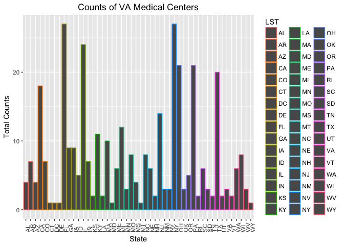
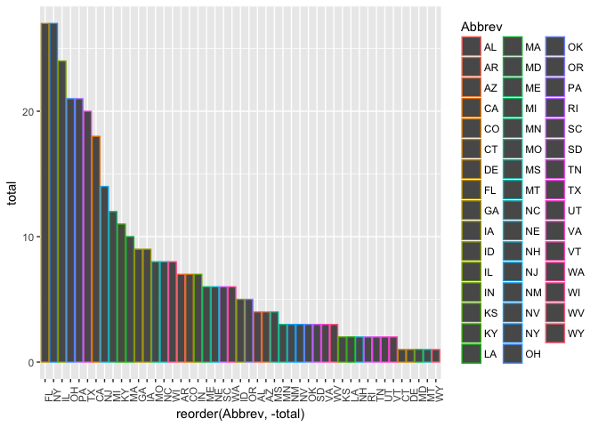
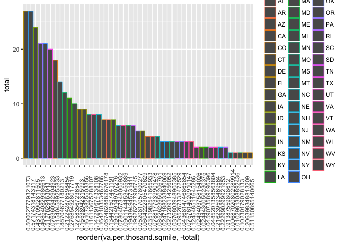

# VaHealth Medical Centers Counts
Venkat Kasarla  
11/23/2017  


## Presented by  Venkat Kasarla 

<br>

# Introduction
Interested to know about Veterans Administration (VA) medical centers in the mainland United States—create a listing of counts of these centers by state, including only mainland locations. Alaska, Hawaii, and U.S.territories should be omitted. DC, while not a state, is in the mainland.

<br>

### 1-a.load the VA Health rda data


```r
load_rda_object <- function(fname){
  e <- new.env(parent = parent.frame())
  load(fname, e)
  return(e[[ls(e)[1]]])
}
```

<br>


```r
va.data <- load_rda_object('../data/N-MHSS-2015-DS0001-bndl-data-r/N-MHSS-2015-DS0001-data/N-MHSS-2015-DS0001-data-r.rda')
```

<br>

### 1-b.state abbreviations without their counts and leaning state abbreviations to valid ones


```r
st.abbr <- unique(va.data$LST) %>% as.vector()
st.abbr <- gsub(" ", "", st.abbr)
```


<br>

### 1-c.Exclude Alaska - AK, Hawai - HI, US territory state code  AS, GU, PR, VI 


```r
st.abbr.filt <- st.abbr[st.abbr != "AK"]
st.abbr.filt <- st.abbr.filt[st.abbr.filt != "HI"]
st.abbr.filt <- st.abbr.filt[st.abbr.filt != "AS"]
st.abbr.filt <- st.abbr.filt[st.abbr.filt != "GU"]
st.abbr.filt <- st.abbr.filt[st.abbr.filt != "PR"]
st.abbr.filt <- st.abbr.filt[st.abbr.filt != "VI"]
va.data$LST <- gsub(" ", "", va.data$LST)
va.data.mainland <- select(va.data,LST,FACILITYTYPE) %>% filter(LST %in% st.abbr.filt ) %>% filter(grepl("Veterans Administration medical center",FACILITYTYPE))
va.data.cnt <- select(va.data.mainland,LST) %>% group_by(LST) %>% data.frame() 
#Counts of VA medical centers  by State
va.data.cnt <- va.data.cnt %>% group_by(LST) %>% summarise(total =n()) %>% data.frame() 
```


<br>

### 1-d.VA Medical Centre Counts Bar Plot


```r
ggplot(va.data.cnt, aes(x=LST, y=total,col=LST)) +  geom_bar(stat="identity") + theme(axis.text.x = element_text(angle=90, hjust=0)) + scale_linetype_discrete(name="VA Medical Centre Counts") + xlab("State") + ylab("Total Counts") + ggtitle("Counts of VA Medical Centers") + theme(plot.title = element_text(hjust = 0.5))
```

<!-- -->

### 2-a read the statesize.csv and see the issue in LST , State abbreviation is cleaned in 1A to remove space in order to have valid state code and  merge


```r
state.size <- read.csv('../data/statesize.csv')
```

<br>

### 2-b.Merge the such that we can calculate the VA hospitals per thousand square miles


```r
va.merged <- merge(x=state.size, y=va.data.cnt , by.x = "Abbrev" , by.y="LST")
```

<br>

### 2-c.calculate new variable VA hospitals per thousand square miles.


```r
va.merged$va.per.thosand.sqmile <- 0.001
data.frame(lapply(va.merged, function(y) if(is.numeric(y)) round(y, 3) else y))
```

```
##    Abbrev      StateName SqMiles    Region total va.per.thosand.sqmile
## 1      AL        Alabama   50750     South     4                 0.001
## 2      AR       Arkansas   52075     South     7                 0.001
## 3      AZ        Arizona  113642      West     4                 0.001
## 4      CA     California  155973      West    18                 0.001
## 5      CO       Colorado  103730      West     7                 0.001
## 6      CT    Connecticut    4845 Northeast     1                 0.001
## 7      DE       Delaware    1955     South     1                 0.001
## 8      FL        Florida   53997     South    27                 0.001
## 9      GA        Georgia   57919     South     9                 0.001
## 10     IA           Iowa   55875   Midwest     9                 0.001
## 11     ID          Idaho   82751      West     5                 0.001
## 12     IL       Illinois   55593   Midwest    24                 0.001
## 13     IN        Indiana   35870   Midwest     7                 0.001
## 14     KS         Kansas   81823   Midwest     2                 0.001
## 15     KY       Kentucky   39732     South    11                 0.001
## 16     LA      Louisiana   43566     South     2                 0.001
## 17     MA  Massachusetts    7838 Northeast    10                 0.001
## 18     MD       Maryland    9775     South     1                 0.001
## 19     ME          Maine   30865 Northeast     6                 0.001
## 20     MI       Michigan   56539   Midwest    12                 0.001
## 21     MN      Minnesota   79617   Midwest     3                 0.001
## 22     MO       Missouri   68898   Midwest     8                 0.001
## 23     MS    Mississippi   46914     South     4                 0.001
## 24     MT        Montana  145556      West     1                 0.001
## 25     NC North Carolina   48718     South     8                 0.001
## 26     NE       Nebraska   76878   Midwest     6                 0.001
## 27     NH  New Hampshire    8969 Northeast     2                 0.001
## 28     NJ     New Jersey    7419 Northeast    14                 0.001
## 29     NM     New Mexico  121365      West     3                 0.001
## 30     NV         Nevada  109806      West     3                 0.001
## 31     NY       New York   47224 Northeast    27                 0.001
## 32     OH           Ohio   40953   Midwest    21                 0.001
## 33     OK       Oklahoma   68679     South     3                 0.001
## 34     OR         Oregon   96003      West     5                 0.001
## 35     PA   Pennsylvania   44820 Northeast    21                 0.001
## 36     RI   Rhode Island    1045 Northeast     2                 0.001
## 37     SC South Carolina   30111     South     6                 0.001
## 38     SD   South Dakota   75898   Midwest     3                 0.001
## 39     TN      Tennessee   41220     South     2                 0.001
## 40     TX          Texas  261914     South    20                 0.001
## 41     UT           Utah   82168      West     2                 0.001
## 42     VA       Virginia   39598     South     3                 0.001
## 43     VT        Vermont    9249 Northeast     2                 0.001
## 44     WA     Washington   66582      West     6                 0.001
## 45     WI      Wisconsin   54314   Midwest     8                 0.001
## 46     WV  West Virginia   24087     South     3                 0.001
## 47     WY        Wyoming   97105      West     1                 0.001
```

```r
va.merged <- va.merged %>% mutate(va.per.thosand.sqmile = (total/SqMiles*1000))
```


<br>


### 2-d.ggplot state on x axis for every square thousand miles for VA


```r
va.merged$logSqmile = log(va.merged$va.per.thosand.sqmile)
ggplot(va.merged, aes(x = reorder(Abbrev, -total), y = total,color=Abbrev)) +  geom_bar(stat="identity") + theme(axis.text.x = element_text(angle=90, hjust=0))
```

<!-- -->

```r
quantile(va.merged$va.per.thosand.sqmile)
```

```
##          0%         25%         50%         75%        100% 
## 0.006870208 0.050300921 0.116113675 0.214241235 1.913875598
```

```r
ggplot(va.merged, aes(x = reorder(va.per.thosand.sqmile, -total), y = total,color=Abbrev)) + geom_bar(stat="identity") + theme(axis.text.x = element_text(angle=90, hjust=0))
```

<!-- -->


<br>


### 2-e pattern and analysis

##### NJ, VT states  would have the 2 Veteran Medical Centers per  thousand sq miles approximately. RI State have atleast one Veteran Medical Centers per  thousand sq miles. The most of States  with higher frequency except NJ,VT does not seems to have the VA medical center per thousand square miles. RI State seems to have VA medical Center with lower frequency.we have to take consideration of other variables along with frequency , square miles to study further in detail of data.


<br><br><br>
